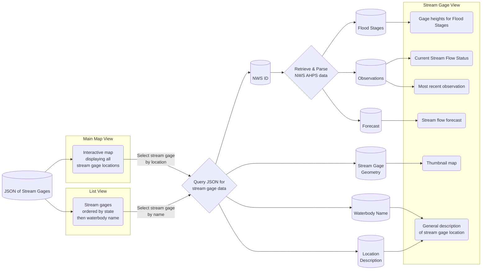

# FloodNotice-iOS
Swift based iOS app to view stream gages with coverage by the National Weather Service's Advanced Hydrologic Prediction Service.


## Overview



---

## Demo


---

## Current Coverage

```geojson
{
  "type": "FeatureCollection",
  "features": [
    {
      "type": "Feature",
      "id": 1,
      "properties": {
        "ID": 0
      },
      "geometry": {
        "type": "Polygon",
        "coordinates": [
          [
              [-97.26691933,37.60076195],
              [-97.26691933,34.64466615],
              [-89.50761168,34.64466615],
              [-89.50761168,37.60076195],
              [-97.26691933,37.60076195]
          ]
        ]
      }
    }
  ]
}
```

---

## License

FloodNotice is released under the MIT license. See [LICENSE](LICENSE) for details.
